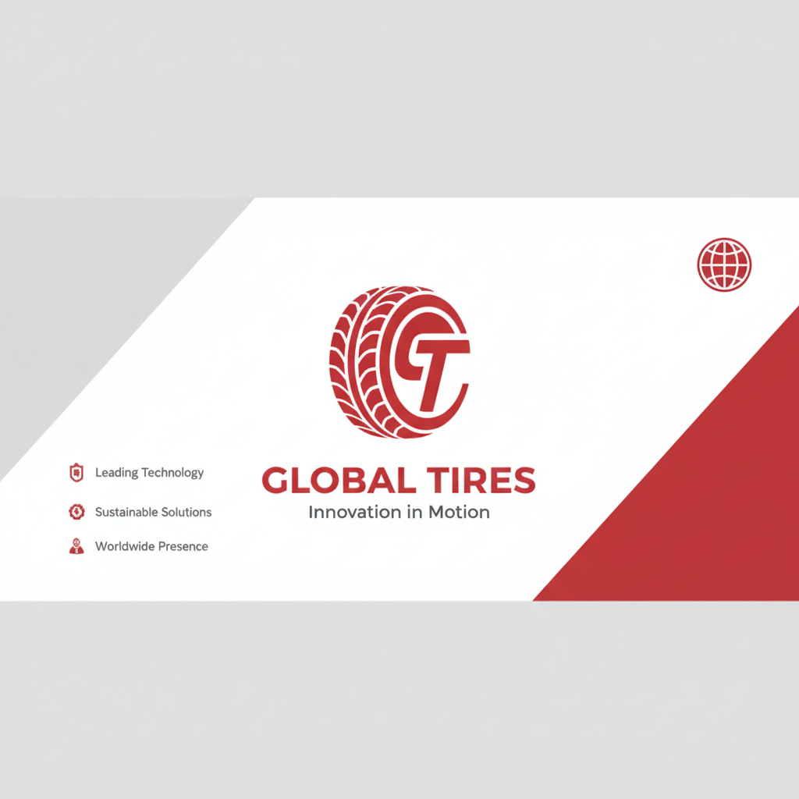
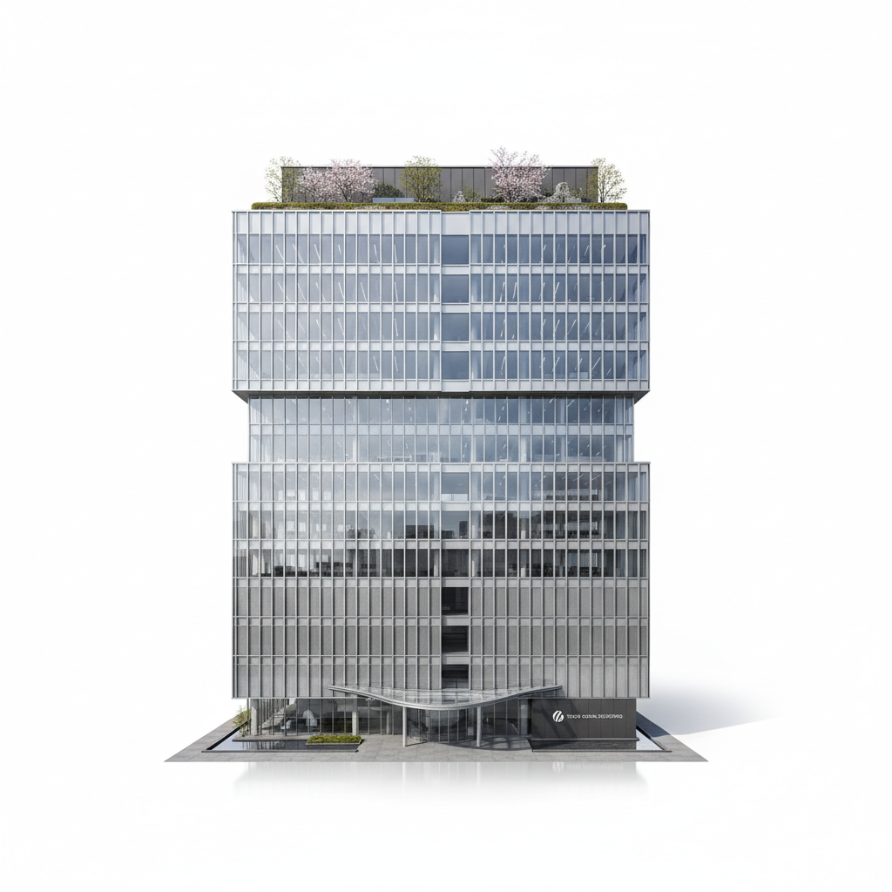
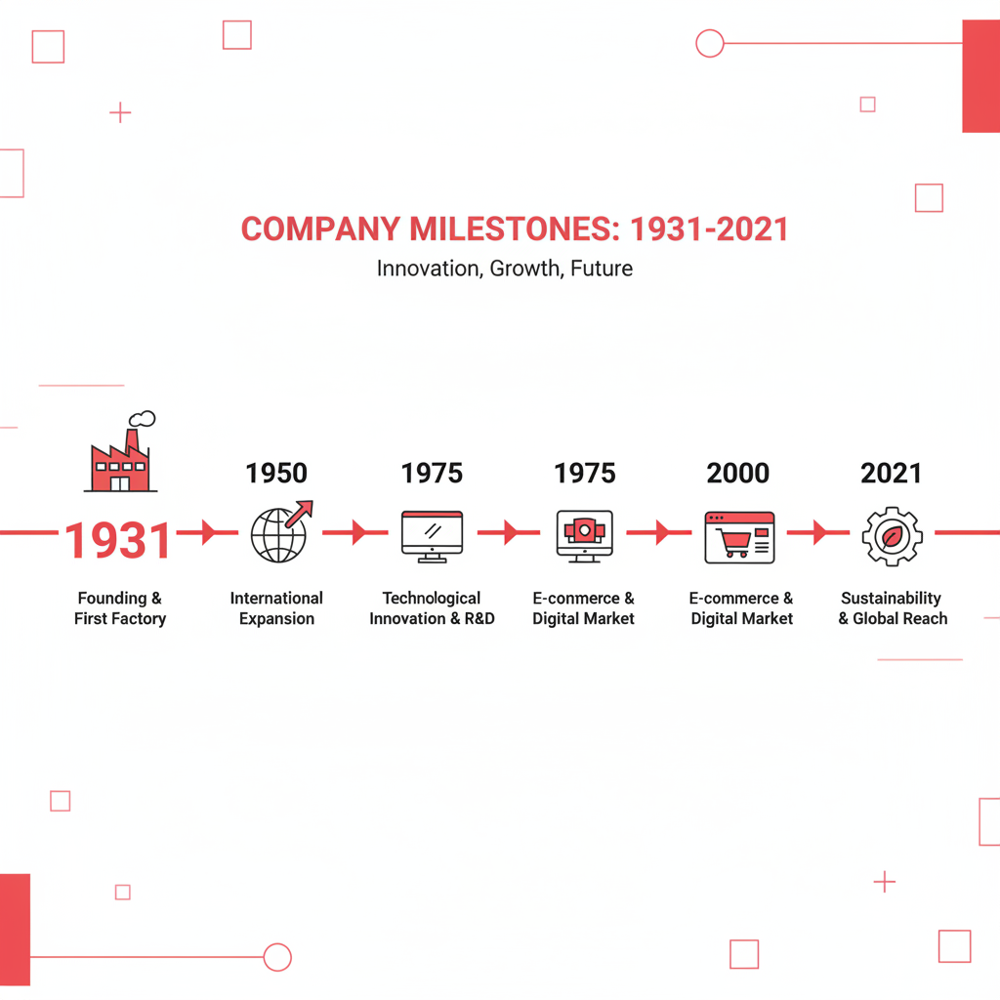
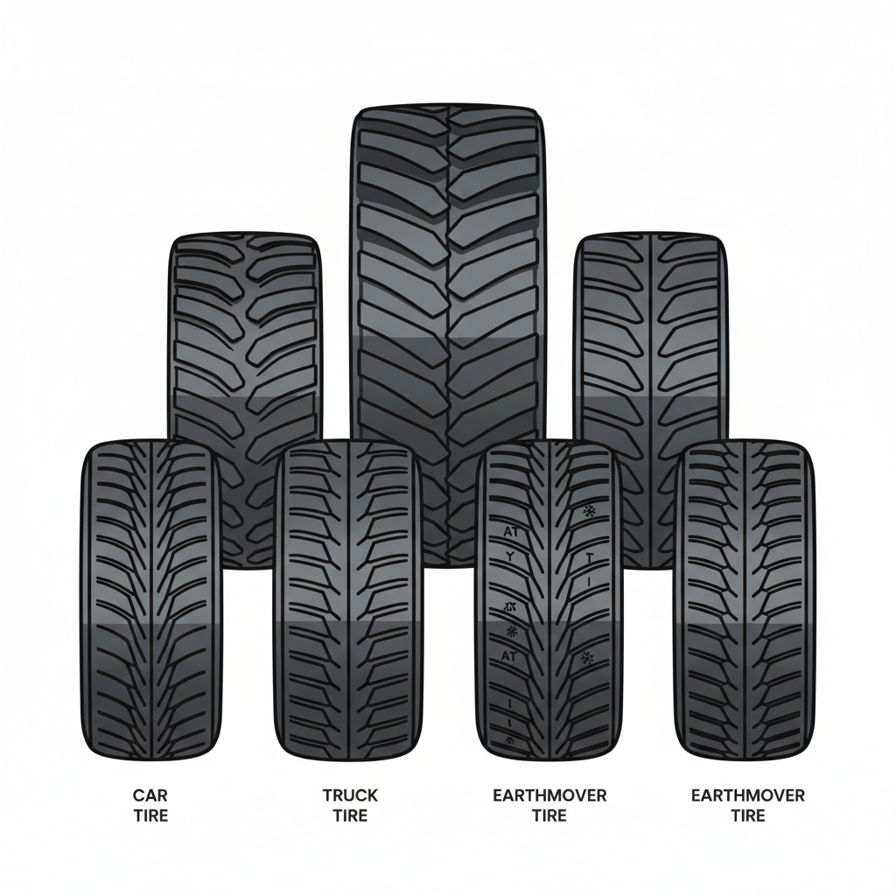
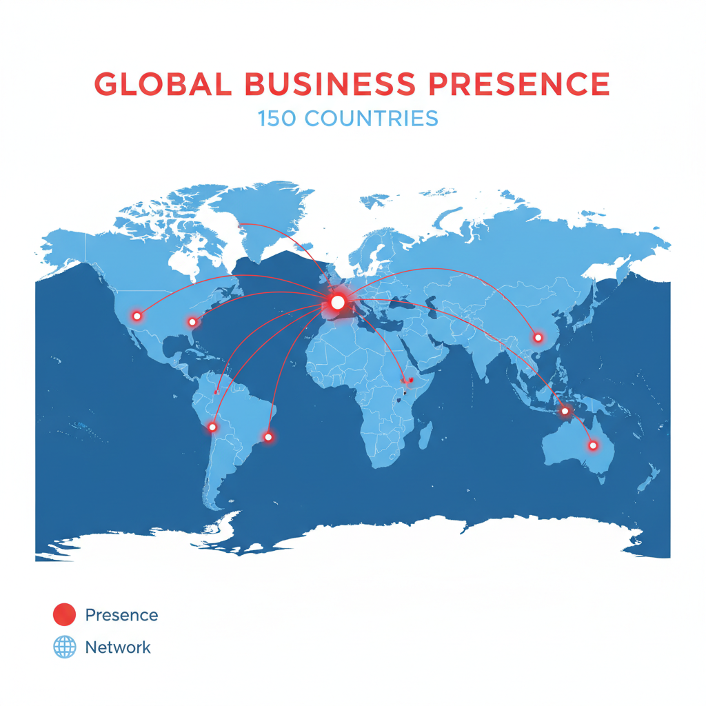
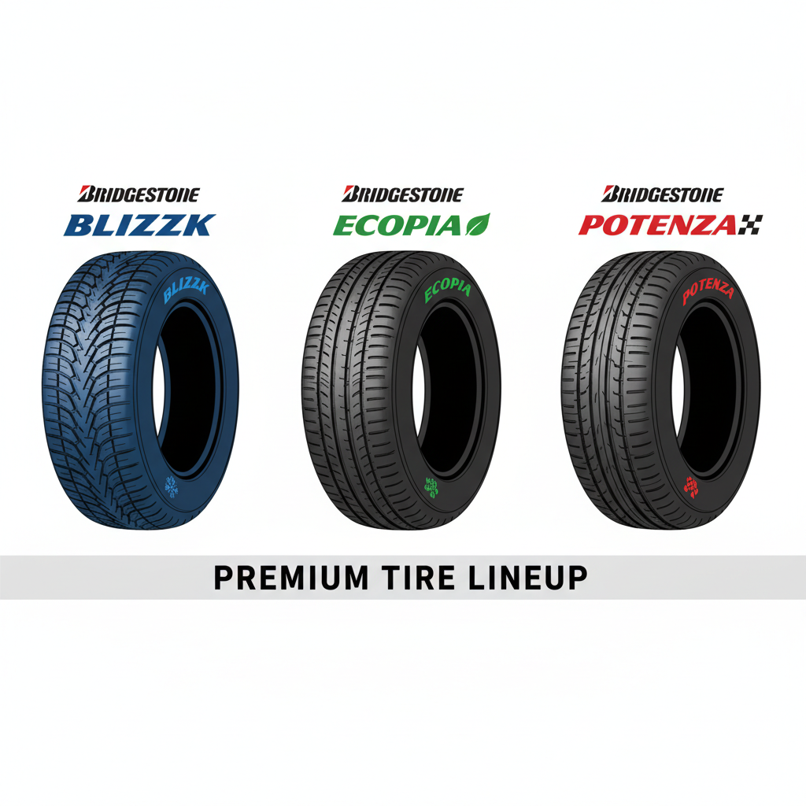
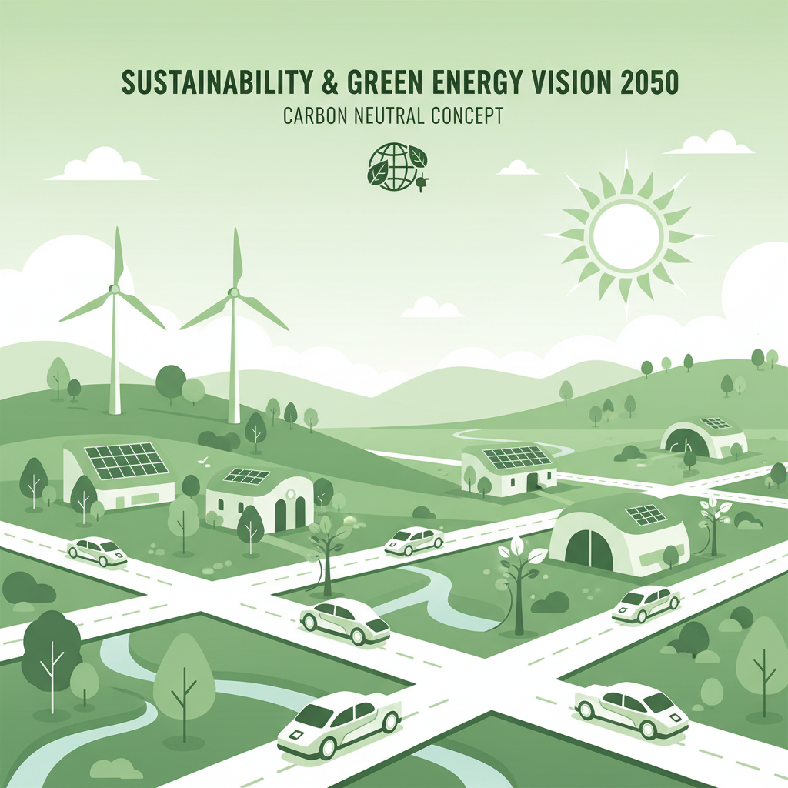
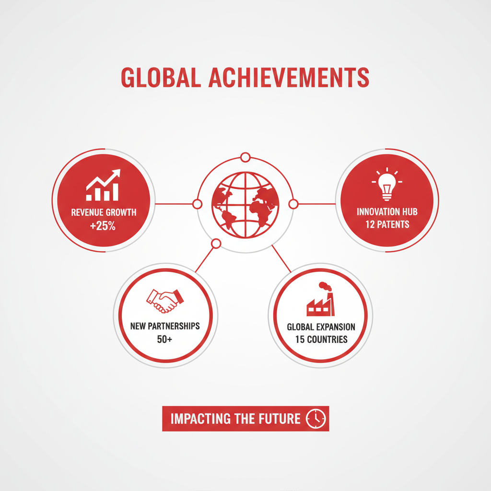

<!-- _class: cover -->

# 株式会社ブリヂストン
## 会社紹介

世界をリードするタイヤ・ゴム製品メーカー

---

## 目次

1. 会社概要
2. 創業の歴史
3. 主要事業
4. グローバル展開
5. ブランド・製品
6. 経営ビジョン
7. まとめ

---

## 会社概要

| 項目 | 内容 |
|------|------|
| 会社名 | 株式会社ブリヂストン |
| 設立 | 1931年（昭和6年）3月1日 |
| 本社 | 東京都中央区京橋三丁目 |
| 従業員数 | 約14万人（グループ全体） |
| 売上高 | 約4.1兆円（2023年度） |
| 上場 | 東京証券取引所 プライム市場 |

---

## 創業の歴史

- **1931年** 石橋正二郎が福岡県久留米市にて創業
  - 社名は創業者の姓「石橋」の英訳
- **1951年** タイヤ輸出開始、海外展開スタート
- **1988年** 米国ファイアストン社を買収
- **2005年** 世界150ヵ国以上でビジネス展開
- **2021年** 創業90周年、サステナビリティ経営を加速

---

## 主要事業

### タイヤ事業（売上の約80%）
- 乗用車用・トラック・バス用・二輪車用タイヤ
- 農業機械・建設・鉱山車両用タイヤ

### 多角化製品事業
- 自動車部品（ホース・防振ゴムなど）
- 土木・建築資材 / 航空機部品
- スポーツ用品・自転車

---

## グローバル展開

- **生産拠点**: 世界25ヵ国以上、150工場超
- **販売**: 150ヵ国以上で展開
- **研究開発**: 日本・米国・欧州・中国に R&D センター

| 地域 | ブランド |
|------|---------|
| 北米・南米 | Firestone, Bridgestone Americas |
| 欧州・中東・アフリカ | Bridgestone EMEA |
| アジア・太平洋 | Bridgestone Asia Pacific |

---

## 主要ブランド・製品

| ブランド | 特徴 |
|---------|------|
| **Bridgestone** | プレミアムタイヤ・フラッグシップ |
| **Firestone** | 北米を中心としたバリュータイヤ |
| **BLIZZAK** | スタッドレスタイヤ・冬季タイヤNo.1 |
| **ECOPIA** | 低燃費・エコタイヤシリーズ |
| **POTENZA** | スポーツ・高性能タイヤ |

---

## 経営ビジョン「Toward 2050」

> 社会価値・顧客価値・経済価値を同時に実現する

- **サステナビリティ**: 2050年カーボンニュートラル達成
- **天然ゴム**: 持続可能な調達100%へ
- **モビリティ**: CASE・EVシフトへの対応
- **イノベーション**: AI・デジタル技術の活用

---

## まとめ

- 1931年創業、世界最大級のタイヤメーカー
- 150ヵ国以上でビジネスを展開するグローバル企業
- タイヤ事業を核に、多角化製品事業も展開
- BLIZZAKをはじめ、国内外で高いブランド力
- 2050年カーボンニュートラルを目指す

---

<!-- _class: cover -->

# ありがとうございました

株式会社ブリヂストン

https://www.bridgestone.co.jp

